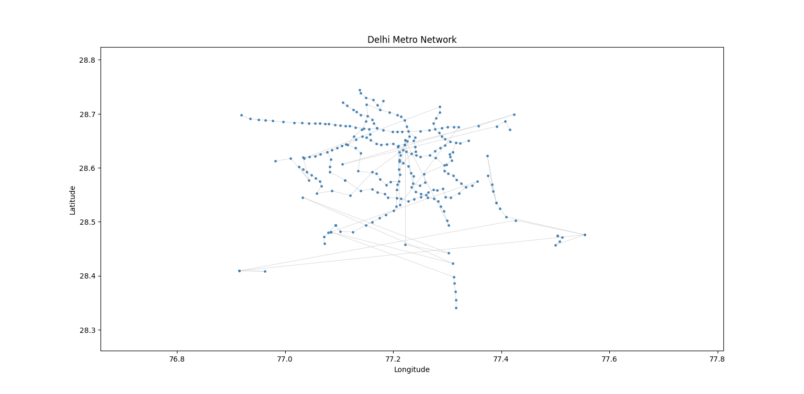
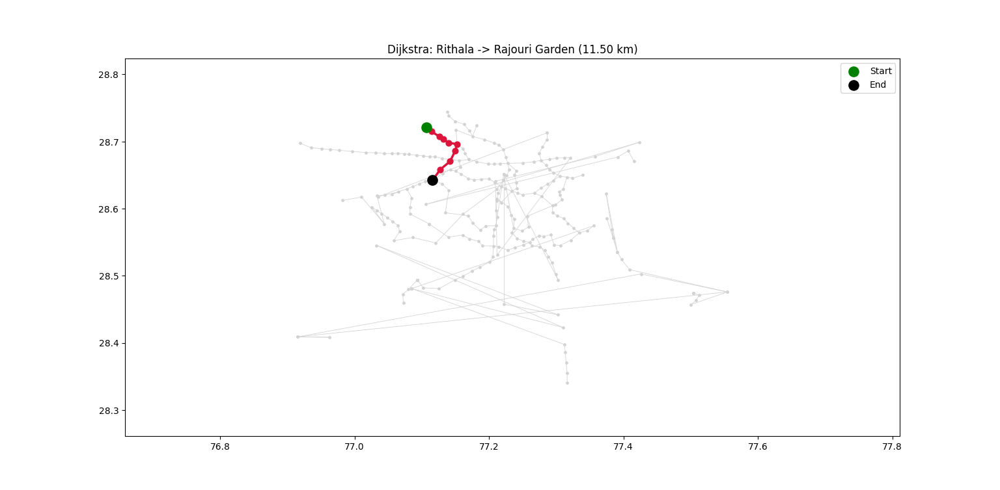
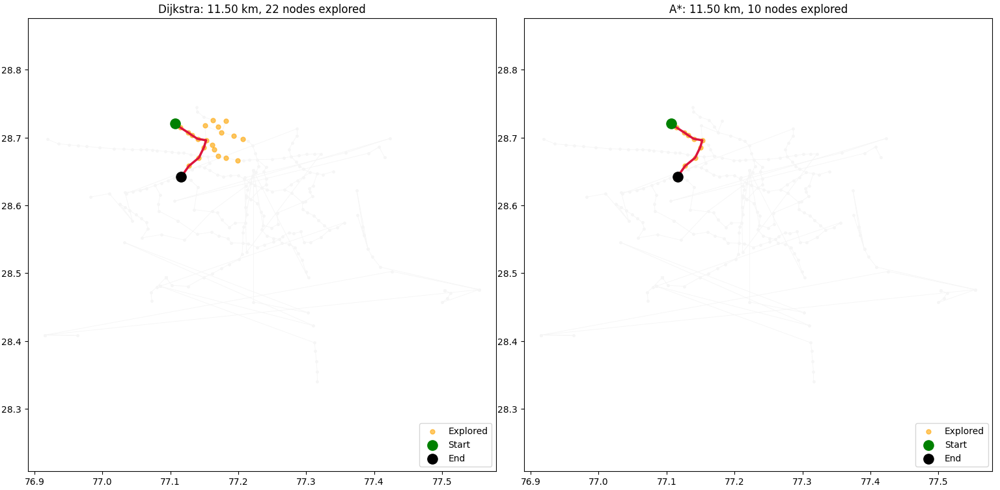

# Delhi Metro Graph Algorithm Visualizer

A from-scratch implementation of core graph algorithms — BFS, Dijkstra, A*, and Kruskal's MST — applied to the real Delhi Metro network, with visualizations comparing how each algorithm searches the graph.

## Why this project

Most "pathfinding visualizer" projects run on a random grid. This one runs on a real transit network (261 stations, 12 lines/branches, ~285 raw station records) with real distances and real geographic coordinates, so the algorithms can be checked against reality and the comparisons actually mean something.

## Dataset

- Source: [Delhi Metro Dataset](https://www.kaggle.com/datasets/arunjangir245/delhi-metro-dataset) (Kaggle), compiled from DMRC/Wikipedia station data.
- Columns used: Station Name, Distance from First Station (km), Line, Latitude, Longitude.
- **Real station order recovered by sorting each line's stations by distance-from-start** — this gives genuine physical adjacency, not an assumption.
- **Real edge weights** = the difference in distance-from-start between consecutive stations on a line (not an approximation).
- **Interchange stations** (e.g. Rajouri Garden, Kashmere Gate) are tagged in the raw data as `Station [Conn: OtherLine]`. These tags are stripped to a canonical station name so the same physical station merges into one graph node across lines — this is what turns ~13 separate line-segments into one connected graph.

### Data cleaning

Three stations had corrupted coordinates in the source CSV (verified against real-world locations):
| Station | Issue | Fix |
|---|---|---|
| Shyam Park | Longitude duplicated from latitude | Corrected to real value (~77.42) |
| Lal Quila | Coordinates placed it ~83 km away, near Faridabad | Corrected to Old Delhi (~28.656, 77.241) |
| Hindon River | Latitude pulled far north of its real position | Corrected to match Red Line neighbors |

All other "far away" stations (Greater Noida, Faridabad, Bahadurgarh) were checked and are **real** — the network genuinely extends that far into satellite cities.

### A real (not a bug) disconnected component

The graph has **2 connected components**: the main 240-station network, and a 21-station Aqua Line cluster (Noida/Greater Noida). This is not a data error — the Aqua Line has **no direct track connection** to the rest of the network. Commuters transfer between Noida Sector 51 (Aqua Line) and Noida Sector 52 (Blue Line) via a pedestrian skywalk, not a rail link. The graph correctly reflects this.

## Algorithms implemented (all from scratch)

| Algorithm | Answers | Big-O |
|---|---|---|
| BFS | Fewest stops (unweighted) | O(V + E) |
| Dijkstra | Shortest real distance | O((V + E) log V) with a binary heap |
| A* | Shortest real distance, exploring fewer nodes | O((V + E) log V), typically much faster in practice |
| Kruskal's MST (with Union-Find) | Minimum total track length connecting all stations | O(E log E) |

**A*'s heuristic** is straight-line (haversine/great-circle) distance to the destination. This is admissible — straight-line distance is always ≤ real track distance, since track winds between stations — so A* is guaranteed to find the same optimal path as Dijkstra, just by exploring fewer nodes.

## Results — example route (Rithala → Rajouri Garden)

| Algorithm | Distance (km) | Stops | Nodes Explored | Optimal for |
|---|---|---|---|---|
| BFS | N/A (unweighted) | 9 | 20 | Fewest stations |
| Dijkstra | 11.50 | 9 | 22 | Shortest real distance |
| A* | 11.50 | 9 | **10** | Shortest distance, fewer nodes explored |

Dijkstra and A* find the identical optimal path — but A* explores **less than half** as many nodes, because its heuristic prioritizes search toward the destination instead of expanding uniformly in all directions.

**Kruskal's MST**: connects all stations in the main network with a minimum total of ~329.6 km of track (259 edges for 261 stations, since the graph has 2 components).

## Visualizations

**Full network, plotted on real coordinates:**



**Single-route highlight (Dijkstra, start in green, end in black):**



**Side-by-side Dijkstra vs. A\* comparison** — showing not just the final path but every node each algorithm explored during search. Dijkstra's explored nodes (orange) spread out in a wide radius around the start; A*'s stay tightly funneled toward the destination, exploring less than half as many nodes for the same optimal answer:



## Project structure

```
delhi-metro-graph-project/
├── main.py                      # runs the full pipeline end-to-end
├── data/
│   ├── Delhi metro.csv          # raw dataset
│   └── data_loader.py           # CSV parsing, coordinate fixes, canonical name resolution
├── src/
│   ├── graph_algorithms.py      # Graph class + BFS, Dijkstra, A*, Kruskal's MST
│   └── visualize.py             # network plot, path highlight, algorithm comparison plot
└── images/                      # saved plot outputs, embedded in this README
    ├── metro_network.png
    ├── dijkstra_path.png
    └── dijkstra_vs_astar_comparison.png
```

Run with:
```bash
python main.py
```

Dataset: `Delhi metro.csv` ([source](https://www.kaggle.com/datasets/arunjangir245/delhi-metro-dataset)).

## What I'd improve with more time

- Model the Sector 51 ↔ Sector 52 pedestrian skywalk as a separate, clearly-labeled "walking transfer" edge type, so routes can use it without conflating it with real rail track.
- Interactive web version (currently static plots via matplotlib).
- Fare-based shortest path (cost, not just distance) using DMRC's published fare slabs.
