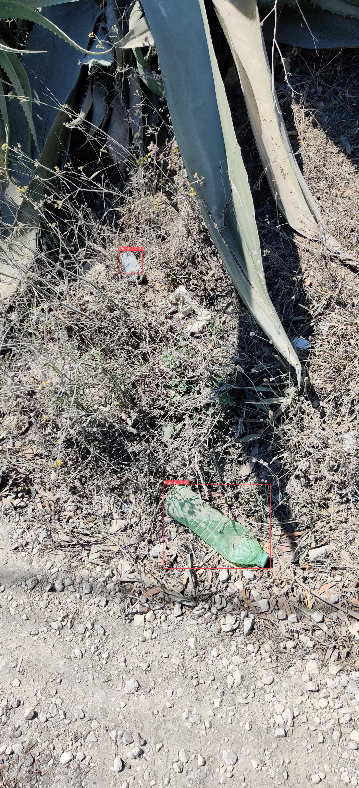
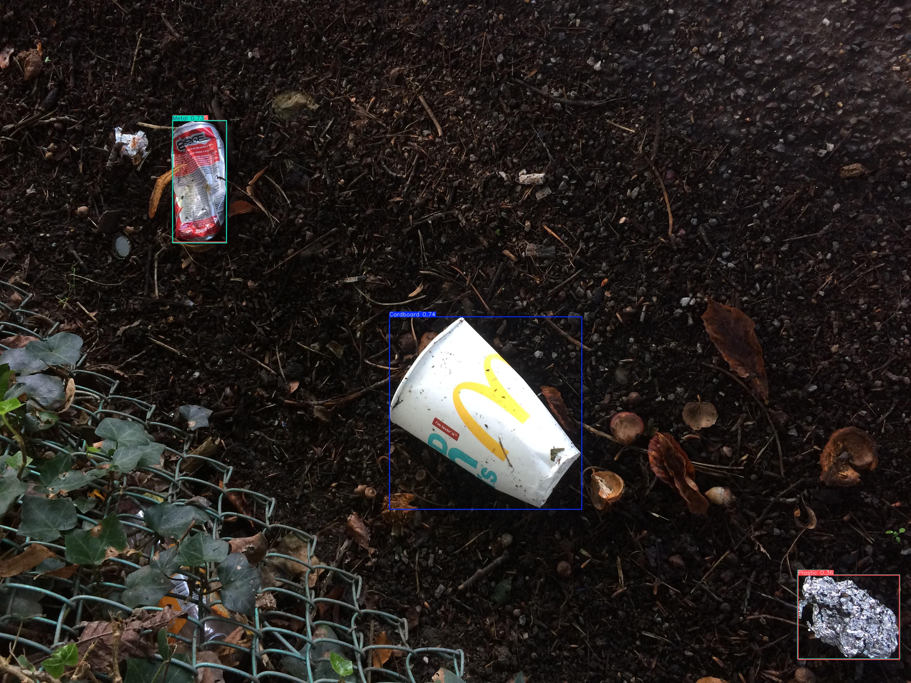
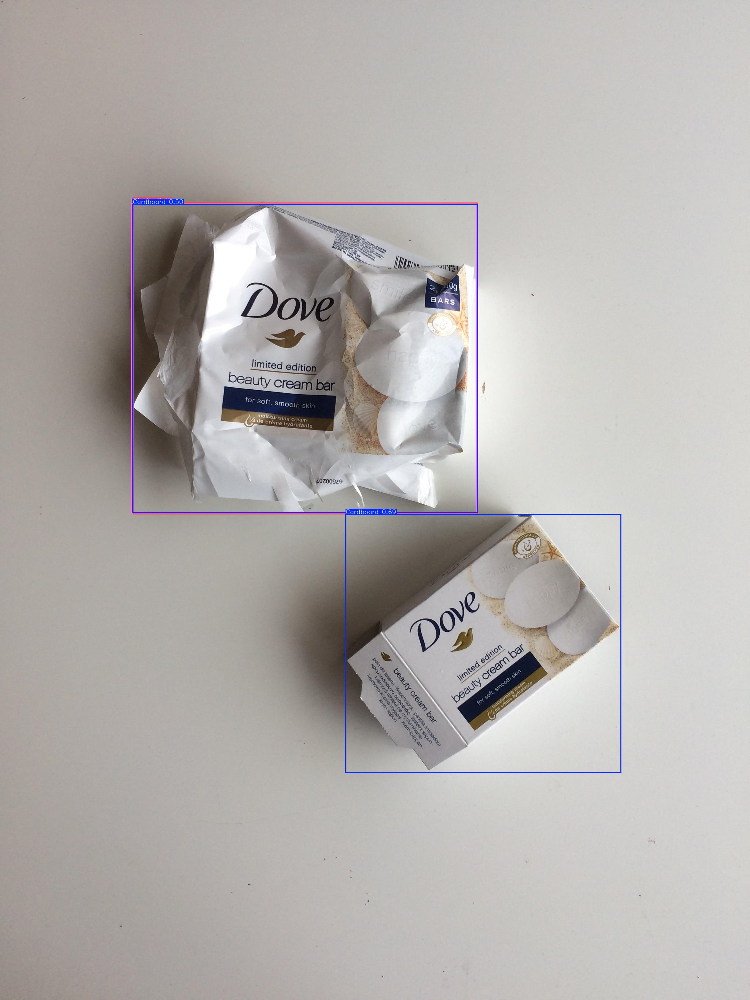

# Waste Object Detection (TACO Dataset) — YOLOv8

Multi-class object detection model that identifies and localizes litter in real-world scenes (streets, beaches, parks), using the TACO (Trash Annotations in Context) dataset and YOLOv8.

This project is a companion to a separate [waste image classification project](../Image%20Classification) — this one focuses on **detection** (localizing multiple objects in a scene), which is a meaningfully harder task than single-object classification.

## Problem

Given a photo of a real-world scene (potentially cluttered, with varying lighting and backgrounds), detect and classify every piece of litter present — not just say "what is this," but "where is it, and what is it."

## Dataset

This project uses the [TACO (Trash Annotations in Context)](http://tacodataset.org/) dataset, accessed via the [Kaggle mirror](https://www.kaggle.com/datasets/kneroma/tacotrashdataset).

- 1,500 images, 4,784 annotations, 60 raw fine-grained categories
- Real-world litter photos: beaches, streets, parks, varying lighting/backgrounds/occlusion
- Dataset is **not included in this repo** (see licensing note below) — download via the Kaggle link above.

## Approach

### 1. Class merging
TACO's 60 raw categories were merged into 8 material-based supercategories, since most raw classes had too few examples (many under 20) to be individually learnable:

| Final Class | Merged from (examples) |
|---|---|
| Plastic | bottles, wrappers, film, cups, straws, lids, bags, containers |
| Metal | cans, metal caps/lids, foil, scrap metal, aerosol, battery |
| Glass | bottles, jars, cups, broken glass |
| Paper | normal/magazine/wrapping paper, tissues, paper bags/cups |
| Cardboard | cartons, pizza box, toilet tube |
| Cigarette | cigarette butts |
| Styrofoam | styrofoam pieces, foam containers/cups |
| Other | shoe, rope & strings, food waste |

**Note:** TACO's "Unlabeled litter" category (517 annotations) was deliberately excluded. Empirical testing showed that removing this catch-all, visually-inconsistent class improved detection performance on the *other* classes as well — not just the overall average — suggesting it was actively interfering with shared feature learning during training.

### 2. Data cleaning
- Filtered out bounding boxes smaller than 0.05% of image area (mostly annotation noise — confirmed by manual visual inspection of misclassified examples)
- 70/15/15 train/val/test split at the image level

### 3. Model
- **YOLOv8s** (11M params) via [Ultralytics](https://github.com/ultralytics/ultralytics)
- A larger variant (YOLOv8m) was tested and underperformed — consistent with overfitting risk on a dataset this size (~1,500 images)
- Input resolution: 864–960px (up from an initial 640px baseline) — this targeted small/thin objects (e.g. cigarette butts) specifically, and produced the single largest measured improvement in the project
- Reduced mosaic augmentation, disabled mixup, cosine LR schedule, increased box-loss weighting, extended warmup

## Results

**Final test set (225 held-out images, never used in training or tuning):**

| Metric | Value |
|---|---|
| mAP50 | **0.236** |
| mAP50-95 | 0.188 |

| Class | Precision | Recall | mAP50 |
|---|---|---|---|
| Plastic | 0.388 | 0.648 | 0.504 |
| Metal | 0.378 | 0.528 | 0.374 |
| Styrofoam | 0.366 | 0.500 | 0.298 |
| Cardboard | 0.241 | 0.278 | 0.243 |
| Cigarette | 0.529 | 0.051 | 0.178 |
| Glass | 0.221 | 0.200 | 0.156 |
| Paper | 0.273 | 0.174 | 0.129 |
| Other | 1.000 | 0.000 | 0.002 |

### Experimental progression

| Stage | Key change | Val mAP50 |
|---|---|---|
| Baseline | YOLOv8n, 640px | 0.197 |
| + Resolution & capacity | YOLOv8s, 960px | 0.225 |
| + Class cleanup & box filtering | Dropped noisy class, filtered tiny boxes | 0.261 |
| + Loss/schedule tuning | box=10, cosine LR, longer warmup | 0.265 |
| **Final (held-out test)** | | **0.236** |

## Sample predictions

Bounding boxes are model predictions with confidence scores. More examples in the `sample_predictions/` folder.





## Key findings

- **Material ambiguity drives most errors.** Glass, Plastic, and Metal are visually confusable due to shared reflective/transparent properties — this same pattern appeared independently in a separate classification project, confirming it's a genuine property of these materials rather than an artifact of this specific model.
- **Small objects are fundamentally harder to localize.** Cigarette recall remains low (0.051 on test) despite reasonable precision (0.529) — thin, tiny objects occupy very few pixels, a known weakness of grid-based detectors like YOLO.
- **Higher resolution had the single biggest impact** on small-object detection — increasing input size from 640px to 960px roughly tripled Cigarette's mAP50.
- **Rare classes (Other, with only 3 test instances) are statistically unreliable** — too few real-world examples to draw firm conclusions either way.

## Limitations

- Small dataset (~1,500 images total) by object detection standards — COCO, for comparison, has ~118,000 training images.
- Some classes have very few test instances, making individual scores noisy.
- Model cannot detect "Unlabeled litter" — this class was deliberately excluded (see rationale above), which is a real capability gap for deployment, not just a scoring nuance.
- Not yet optimized for real-time / edge deployment.

## What's next with more resources

- More labeled data, especially for Glass, Paper, Cigarette, and Other
- Two-stage approach: class-agnostic localization + a specialized material classifier (leveraging strengths from the companion classification project)
- Explore TACO's larger unlabeled Flickr image pool for semi-supervised pretraining

## Tech stack

- Python, PyTorch, Ultralytics YOLOv8
- Trained on Kaggle (Tesla T4 GPU)

## Repo contents

```
Object Detection/
├── README.md
├── object-detection.ipynb           # full training/eval pipeline
├── best_model.pt                    # trained YOLOv8s weights
├── data.yaml                        # class list / dataset config used for training
├── results.png                      # training curves
├── results.csv                      # raw per-epoch metrics
├── confusion_matrix.png
├── confusion_matrix_normalized.png
├── labels.jpg                       # label distribution plot
├── test_results_summary.txt
└── sample_predictions/               # sample annotated predictions
```

Dataset is not included — see the Dataset section above for the download link.
